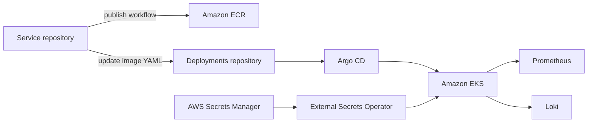

# Sports Store Deployments

GitOps source of truth for deploying Sports Store to Kubernetes. Argo CD continuously compares this repository with the cluster and reconciles approved changes.

## Contents

- [Responsibilities](#responsibilities)
- [Production flow](#production-flow)
- [Repository layout](#repository-layout)
- [Prerequisites and validation](#prerequisites-and-validation)
- [Bootstrap and deployment](#bootstrap-and-deployment)
- [Observability and security](#observability-and-security)
- [CI/CD and troubleshooting](#cicd-and-troubleshooting)

## Responsibilities

This repository owns raw Kubernetes examples, the parent Helm chart, production image pins, Argo CD applications/projects, controller bootstrap, External Secrets resources, monitoring, logging, cost visibility, and cluster diagnostics. Application source belongs in the service repositories; AWS resources belong in [sports-store-infrastructure](https://github.com/Deploy-On-Friday2-0/sports-store-infrastructure).

## Production flow



`apps/root-app.yaml` is the App-of-Apps entry point. Sync waves create Argo Rollouts first, MongoDB and its namespace next, Redis Sentinel next, backend services at wave `0`, and the gateway at wave `1`. MongoDB and Redis persistent volumes use the infrastructure-managed `ebs-gp3-retain` storage class.

## Repository layout

| Path | Purpose |
| --- | --- |
| `helm/sports-store/` | Parent chart for frontend, gateway, five backends, MongoDB, and Redis |
| `environments/production/images/` | Production image repository/digest pins changed by publish workflows |
| `apps/` | Argo CD applications for workloads and platform add-ons |
| `projects/` | Argo CD project boundaries |
| `bootstrap/` | Pinned namespace and Argo CD installation manifests |
| `k8s/` | Earlier raw-manifest deployment path and add-on values |
| `observability/` | Prometheus rules and Grafana dashboard resources |
| `secrets/` | ExternalSecret definitions; never plaintext secret values |
| `load-testing/k6/` | k6 load scenarios and [usage guide](load-testing/k6/README.md) |
| `docs/` | Detailed operational procedures |

Focused documentation: [Helm chart](helm/sports-store/README.md), [raw Kubernetes](k8s/README.md), [bootstrap](bootstrap/README.md), [GitOps bootstrap/rollback](docs/gitops-bootstrap.md), [production image promotion](environments/production/README.md), [External Secrets](k8s/external-secrets/README.md), [Kubecost](apps/kubecost/README.md), and [K8sGPT](apps/k8sgpt/README.md).

## Prerequisites and validation

Install Helm 3, `kubectl`, and access to the target cluster. Argo CD, Argo Rollouts, External Secrets Operator, the AWS load balancer controller, and the EBS CSI driver are part of the verified production design.

Safe local checks do not require cluster access:

```bash
helm dependency build helm/sports-store
helm lint helm/sports-store
helm template sports-store helm/sports-store --values helm/sports-store/values.yaml > rendered.yaml
helm unittest helm/sports-store
pytest
```

Review `rendered.yaml` for generated Kubernetes objects; do not commit it. The default values are a chart baseline, while Argo CD applications selectively enable one workload per child application and use production image pins.

## Bootstrap and deployment

Use the exact order and verification commands in [docs/gitops-bootstrap.md](docs/gitops-bootstrap.md). At a high level:

1. Provision AWS/EKS with the infrastructure repository.
2. Configure cluster access and required controllers/secrets integration.
3. Apply the pinned bootstrap manifests.
4. Apply `projects/sports-store-project.yaml` and `apps/root-app.yaml`.
5. Let Argo CD reconcile; promote images through service publish workflows, not manual production edits.

Avoid direct `kubectl edit` changes to GitOps-managed objects because Argo CD will overwrite them. Roll back by reverting the Git commit or following the documented Argo CD rollback procedure.

## Observability and security

Prometheus/Grafana collect application and Redis metrics; Loki and Alloy provide logs; Kubecost provides cost visibility; K8sGPT supplies optional cluster diagnostics. Alerting and dashboard definitions are versioned here.

- Secret manifests reference AWS Secrets Manager through External Secrets; they do not contain values.
- Production images are pinned by digest in `environments/production/images/`.
- The Argo CD AppProject limits repositories, namespaces, and cluster-scoped resources.
- Do not commit kubeconfigs, cloud credentials, generated secrets, or rendered secret data.

## CI/CD and troubleshooting

`Helm validation` checks branch naming, Helm dependencies, linting, rendering, unit tests, and repository acceptance scripts. The post-CI AI review is advisory and documented in [review_runner/README.md](review_runner/README.md).

- Argo CD `OutOfSync`: inspect the application diff before syncing; confirm the referenced Git revision and values.
- `ImagePullBackOff`: verify the digest in `environments/production/images/`, ECR existence, and node permissions.
- Pending persistent volume claims: confirm `ebs-gp3-retain` and the EBS CSI driver.
- Missing secrets: inspect the ExternalSecret, ClusterSecretStore, service account role, and AWS secret name.
- Follow [CONTRIBUTING.md](CONTRIBUTING.md) for changes.
