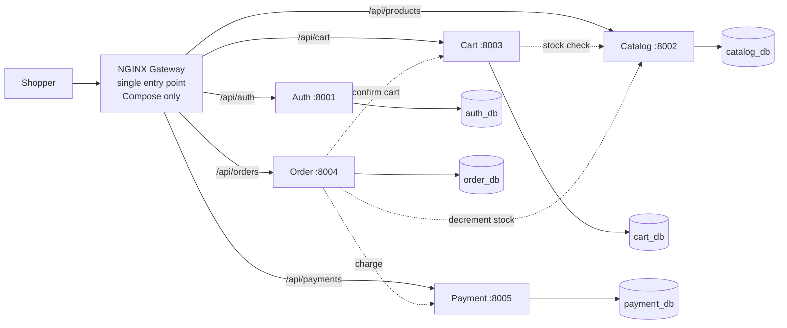
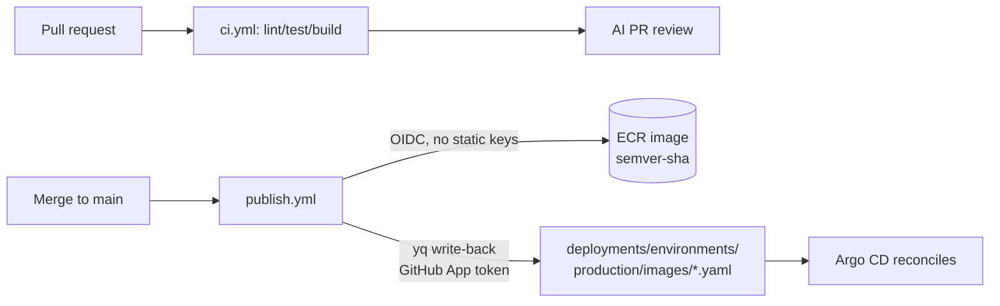

# CloudCart — Project Architecture & Documentation

CloudCart ("Sports Store") is a cloud-native e-commerce platform: five FastAPI
microservices behind an NGINX gateway and a React storefront, shipped to Amazon
EKS through a fully automated, GitOps-driven delivery pipeline with progressive
(canary) rollouts, end-to-end observability, cost tracking, and AI-assisted
incident diagnostics.

This document is the engineer-facing map of the **whole system** across all ten
repositories in the [`Deploy-On-Friday2-0`](https://github.com/orgs/Deploy-On-Friday2-0/repositories)
GitHub organization. For a non-technical walkthrough, see the companion
presentation script.

---

## Table of contents

1. [System at a glance](#1-system-at-a-glance)
2. [Repository map (10 repos)](#2-repository-map-10-repos)
3. [Application architecture](#3-application-architecture)
4. [Request flow (end-to-end)](#4-request-flow-end-to-end)
5. [Data & databases](#5-data--databases)
6. [Local development](#6-local-development)
7. [Cloud infrastructure (Terraform)](#7-cloud-infrastructure-terraform)
8. [Containers & image strategy](#8-containers--image-strategy)
9. [CI/CD pipeline](#9-cicd-pipeline)
10. [GitOps delivery (Argo CD)](#10-gitops-delivery-argo-cd)
11. [Progressive delivery (Argo Rollouts)](#11-progressive-delivery-argo-rollouts)
12. [Observability & cost](#12-observability--cost)
13. [Security & secrets](#13-security--secrets)
14. [Runbooks](#14-runbooks)
15. [Glossary](#15-glossary)

---

## 1. System at a glance

| Plane | What it is | Key technology |
| --- | --- | --- |
| **Experience** | The storefront and the single public entry point | React + Vite frontend, NGINX gateway, CloudFront + ACM |
| **Application** | Five independent business services, one database each | Python / FastAPI, MongoDB |
| **Platform** | The cluster and cloud that run the services | AWS EKS (Kubernetes), ECR, VPC, Terraform Cloud |
| **Delivery** | How code becomes a running release | GitHub Actions (OIDC), Argo CD (GitOps), Helm, Argo Rollouts |
| **Operations** | Seeing, costing, and diagnosing the system | kube-prometheus-stack, Loki + Alloy, Kubecost, K8sGPT |
| **Security** | Keyless access and no secrets in Git | AWS Secrets Manager + External Secrets, EKS Pod Identity, GitHub OIDC |

**Design principles**

- **Polyrepo, one service per repo** — each service scales, ships, and fails independently.
- **Database-per-service** — no service reads another's data; they cooperate via HTTP.
- **Everything as code** — application, cluster, and cloud are all declarative and version-controlled.
- **GitOps** — the live cluster is continuously reconciled to Git; rollback is a `git revert`.
- **Progressive, self-healing releases** — time-paused canary traffic shifting today; a Prometheus metric-gate (`AnalysisTemplate`) is defined and ready to wire in for automatic rollback on bad metrics (see §11).
- **Zero static credentials** — OIDC and Pod Identity everywhere; secrets live in AWS Secrets Manager, never in Git.

---

## 2. Repository map (10 repos)

All under `github.com/Deploy-On-Friday2-0`.

| Repo | Role | Highlights |
| --- | --- | --- |
| [`sports-store-auth-service`](https://github.com/Deploy-On-Friday2-0/sports-store-auth-service) | Auth service | Registration, login, JWT, roles, bcrypt hashing · port `8001` · `auth_db` |
| [`sports-store-catalog-service`](https://github.com/Deploy-On-Friday2-0/sports-store-catalog-service) | Catalog service | Products, variants, filtering, inventory & stock · port `8002` · `catalog_db` |
| [`sports-store-cart-service`](https://github.com/Deploy-On-Friday2-0/sports-store-cart-service) | Cart service | Per-user carts, product snapshots, subtotals · port `8003` · `cart_db` |
| [`sports-store-order-service`](https://github.com/Deploy-On-Friday2-0/sports-store-order-service) | Order service | Checkout orchestration, history, shipping, stock updates · port `8004` · `order_db` |
| [`sports-store-payment-service`](https://github.com/Deploy-On-Friday2-0/sports-store-payment-service) | Payment service | Mock provider, idempotent charges, deterministic declines · port `8005` · `payment_db` |
| [`sports-store-frontend`](https://github.com/Deploy-On-Friday2-0/sports-store-frontend) | Storefront | React 18, React Router, Vite 5; talks to `/api` via the gateway |
| [`sports-store-gateway`](https://github.com/Deploy-On-Friday2-0/sports-store-gateway) | Edge gateway | NGINX single public entry point; reverse-proxies `/api/*` to services |
| [`sports-store-deployments`](https://github.com/Deploy-On-Friday2-0/sports-store-deployments) | **GitOps hub** | Helm parent chart, Argo CD apps, rollouts, observability, this doc |
| [`sports-store-infrastructure`](https://github.com/Deploy-On-Friday2-0/sports-store-infrastructure) | Cloud IaC | Terraform for VPC, EKS, ECR, IAM/OIDC, ACM, CloudFront, Secrets Manager (Terraform Cloud) |
| [`sports-store-local`](https://github.com/Deploy-On-Friday2-0/sports-store-local) | Local dev | Docker Compose for the whole stack + MongoDB seed |

---

## 3. Application architecture

Each service is a small FastAPI app (FastAPI `0.140`, Uvicorn, async MongoDB via
**Motor**, Pydantic v2). Every service exposes:

- `GET /health` — liveness/readiness probe.
- `GET /metrics` — Prometheus metrics via `prometheus-fastapi-instrumentator`
  (high-cardinality labels such as `user_id`/`order_id`/`cart_id` are excluded).

| Service | Port | Database | Responsibility | Depends on |
| --- | --- | --- | --- | --- |
| auth | 8001 | `auth_db` | Accounts, login, JWT issuance, roles | — |
| catalog | 8002 | `catalog_db` | Products, filtering, inventory & stock | — |
| cart | 8003 | `cart_db` | Baskets, quantities, subtotals | catalog |
| order | 8004 | `order_db` | Checkout orchestration, order history | cart, catalog, payment |
| payment | 8005 | `payment_db` | Idempotent charges, mock decline logic | — |

**Gateway routing** (`sports-store-gateway/nginx.conf`) — the single entry point:

| Path | Upstream |
| --- | --- |
| `/` | `frontend:80` |
| `/api/auth/` | `auth:8001` |
| `/api/products`, `/api/internal/` | `catalog:8002` |
| `/api/cart` | `cart:8003` |
| `/api/orders` | `order:8004` |
| `/api/payments` | `payment:8005` |

> **EKS topology note.** `helm/sports-store/values-eks.yaml` disables the gateway and
> frontend **by default**, but the `production-gateway` Argo CD Application explicitly
> re-enables and deploys the gateway workload (`enabledServices: [gateway]`,
> `services.gateway.enabled: true`). The gateway pod therefore still runs on EKS. The
> real distinction from Compose is the **request path**: the ALB `Ingress` routes
> directly to the backend Services (`ingressServices: [auth, catalog, cart, order,
> payment]`) and does **not** send traffic through the gateway, and the frontend is
> served from S3 + CloudFront. This is a deliberate cloud-native deviation from the
> Compose topology — see the repo README/COMPLIANCE for the rationale.

---

## 4. Request flow (end-to-end)

The diagram below shows the **Docker Compose topology**, where the NGINX gateway is
the single entry point and every `/api/*` request is proxied through it. On **EKS the
request path differs**: the ALB `Ingress` routes each `/api/*` prefix directly to the
matching backend Service and does not pass through the gateway (see the EKS topology
note in §3).



**Checkout, step by step**

1. The shopper hits the site. Under Compose every request passes through the gateway;
   on EKS the ALB Ingress routes each `/api/*` prefix straight to the backend Service.
2. Browsing calls the **catalog**; adding to basket calls the **cart**, which
   verifies stock against the catalog.
3. At checkout the **order** service orchestrates: confirm the cart → ask
   **payment** to charge → tell **catalog** to decrement stock → record the order.
4. Each service reads and writes only its **own** database.

---

## 5. Data & databases

- **Database-per-service** — five logical MongoDB databases (`auth_db`,
  `catalog_db`, `cart_db`, `order_db`, `payment_db`). Services never share a
  database; cross-service reads happen over HTTP.
- **Local:** a single `mongo:7.0.39` container hosts all databases (see §6).
- **Production:** a **Bitnami MongoDB ReplicaSet** (3 members, `architecture:
  replicaset`, `replicaSetName: rs0`), deployed as a StatefulSet with
  independent, retained gp3 PVCs per member. Members authenticate to each other
  with a shared keyfile (`mongodb-replica-set-key`) sourced from AWS Secrets
  Manager via External Secrets (see §13).
- Seed data: `sports-store-local/seed/init-mongo.js`.

---

## 6. Local development

`sports-store-local/docker-compose.yml` runs the entire platform on one Docker
network:

- `mongo` (`mongo:7.0.39`) — single instance, per-service databases.
- `auth`, `catalog`, `cart`, `order`, `payment` — built from each service repo.
- `frontend` — React/Vite build.
- `gateway` — NGINX, the only service with published host ports.

```bash
# from the folder containing all the cloned repos
cd sports-store-local
docker compose up --build
# app reachable through the gateway; MongoDB seeded from seed/init-mongo.js
```

Each service can also be run on its own for development (`uvicorn main:app` on its
port) — see the individual repo READMEs.

---

## 7. Cloud infrastructure (Terraform)

`sports-store-infrastructure` is a Terraform root module driven by **Terraform
Cloud** (VCS-driven runs, remote state; workspace `sports-store-infrastructure`).
Terraform `>= 1.11`, AWS provider `~> 5`. Built on public modules, not
hand-rolled resources.

| File | Provisions |
| --- | --- |
| `vpc.tf` | VPC across 3 AZs, public/private subnets, NAT, ELB discovery tags (`terraform-aws-modules/vpc`) |
| `eks.tf` | EKS control plane + managed node group (AL2023); addons: `coredns`, `kube-proxy`, `vpc-cni`, `aws-ebs-csi-driver`, `eks-pod-identity-agent` (`terraform-aws-modules/eks`) |
| `ecr.tf` | One ECR repository per deployable component, `scan_on_push` |
| `iam.tf` | Cluster/node roles; **EKS Pod Identity** roles for EBS CSI, External Secrets, AWS Load Balancer Controller, and Argo Rollouts; GitHub Actions **OIDC** provider + ECR/frontend deploy roles |
| `secrets.tf` | AWS Secrets Manager secret `sports-store/production/config` (write-only payload: `MONGO_INITDB_ROOT_PASSWORD`, `JWT_SECRET_KEY`, `MONGODB_REPLICA_SET_KEY`) |
| `acm.tf` | Regional + `us-east-1` ACM certificates (DNS-validated) |
| `frontend.tf` | S3 bucket + CloudFront distribution serving the static frontend |
| `security.tf`, `variables.tf`, `outputs.tf` | Security groups, inputs, outputs |
| `bootstrap/oidc/` | Standalone bootstrap module |
| `kubernetes/storageclasses/ebs-gp3-retain.yaml` | gp3 StorageClass: `WaitForFirstConsumer`, `Retain`, encrypted |

CI (`terraform-ci.yml`): branch-name check, `terraform fmt`, `terraform validate`
(`-backend=false`), Checkov scan, and static acceptance tests under `tests/`.

---

## 8. Containers & image strategy

- **Multi-stage Docker** on `python:3.11-slim` (pinned by digest). Each image
  `EXPOSE`s its service port, ships a container `HEALTHCHECK` hitting `/health`,
  and runs `uvicorn main:app`.
- Images are pushed to **ECR**, tagged `‹semver›-‹7-char-sha›` (never `latest`).
- The frontend is built and published to **S3/CloudFront** rather than an ECR image.

---

## 9. CI/CD pipeline

Every service repo carries the same workflows:

| Workflow | Trigger | Does |
| --- | --- | --- |
| `ci.yml` | Pull request | Lint, test, build (no push) |
| `publish.yml` | Merge to `main` | Version, build, push image to ECR via **OIDC** (no static keys), then **write the new image tag back** to `sports-store-deployments/environments/production/images/‹service›.yaml` using `yq`, committed with a GitHub App installation token |
| `ai-review-after-ci.yml` + `reusable-ai-review.yml` | After CI | **AI-powered PR reviewer** (OpenRouter) posts findings on the PR |



This is the GitOps handoff: **CI never touches the cluster.** It only updates an
image-tag file in Git; Argo CD does the actual deploy (§10).

---

## 10. GitOps delivery (Argo CD)

`sports-store-deployments` is the single source of truth for the cluster.

- **App-of-apps:** `apps/root-app.yaml` reconciles every downstream Argo CD
  Application in `apps/`.
- **AppProject:** `projects/sports-store-project.yaml` restricts sources and
  destination namespaces (`default`, `apps`, `monitoring`, `logging`, plus narrow
  `sports-store`/`argocd`/`argo-rollouts` exceptions). Third-party charts
  (Kubecost, kube-prometheus-stack, K8sGPT) run in the built-in `default` project.
- **Applications (`apps/`):** `sports-store-production.yaml` (the app Helm
  chart), `argo-rollouts.yaml`, `monitoring/prometheus-stack.yaml`,
  `observability.yaml` (Loki + Alloy), `observability-secrets.yaml`,
  `kubecost/kubecost.yaml`, `k8sgpt-operator.yaml` + `k8sgpt-resources.yaml`,
  `infrastructure.yaml`.
- **Helm chart:** `helm/sports-store` — a parent chart that `range`s over the
  services (`_helpers.tpl`), with the vendored **Bitnami MongoDB** subchart, an
  `ExternalSecret`, an ALB `Ingress`, `ServiceMonitor`s, and the canary
  `AnalysisTemplate`. `values-eks.yaml` carries EKS overrides.
- **Reconciliation:** every Application enables `automated.prune` and
  `automated.selfHeal` — manual cluster drift is reverted automatically.
- **Rollback** is a Git operation: revert the offending image-tag or manifest
  commit and Argo CD restores the previous desired state.

Direct pushes to `main` are blocked; changes arrive via approved PRs or the CI
GitHub App. See [`docs/gitops-bootstrap.md`](gitops-bootstrap.md) for bootstrap
order and boundaries.

---

## 11. Progressive delivery (Argo Rollouts)

`catalog-service` and `order-service` are deployed as Argo **Rollout** CRDs (not
plain Deployments) for progressive canary delivery, integrated with the AWS Load
Balancer Controller for ALB **target-group weighting**.

**Traffic steps** (`helm/sports-store/templates/deployment.yaml`):
`10% (pause 1m) → 25% (pause 1m) → 50% (pause 1m) → 75% (pause 1m) → 100%`.

**Metric analysis (defined, not yet wired in).** An `AnalysisTemplate`
(`sports-store-canary-analysis`, in `helm/sports-store/templates/canary-analysis.yaml`,
gated behind `platform.canaryAnalysis`) is provided and queries Prometheus in the
`monitoring` namespace for:

- **Success rate ≥ 99.5%** — checked every 30s over a 1-minute (`[1m]`) window
  (`2xx/3xx ÷ all` on `http_requests_total`).
- **p95 latency < 250 ms** — checked every 30s over a 1-minute (`[1m]`) window
  (`http_request_duration_seconds_bucket`).

> **Current limitation.** The Rollout `steps` above contain only `setWeight` and
> `pause` — there is **no `analysis` step referencing `sports-store-canary-analysis`**.
> The canary therefore advances on the time-based pauses alone; the AnalysisTemplate
> is **not** currently connected, so there is **no automated metric-gated abort or
> rollback** yet. Wiring an `analysis` step into the Rollout is a follow-up
> implementation change.

The Argo Rollouts controller receives its AWS permissions for target-group
weighting via **EKS Pod Identity** (`argo-rollouts/argo-rollouts` service
account) — provisioned in `sports-store-infrastructure/iam.tf`.

---

## 12. Observability & cost

Deployed declaratively as Argo CD Applications and owned by the observability
scope:

| Capability | Component | Namespace | Notes |
| --- | --- | --- | --- |
| Metrics, dashboards, alerts | **kube-prometheus-stack** (release `prometheus-stack`) | `monitoring` | Grafana sidecar dashboard discovery; Prometheus 15d on gp3; Alertmanager → Slack |
| App scraping | **ServiceMonitor** (`sports-store-servicemonitors.yaml`) | `sports-store` | Scrapes `app.kubernetes.io/part-of: sports-store` every 15s |
| Dashboards | `sports-store-overview.json` | — | CPU/RAM, RPS, 5xx %, p95/p99 latency |
| Alert rules | `observability/alerts/prometheus-rules.yaml` | `monitoring` | ServiceDown, PodCrashLooping, HighHTTPErrorRate, ReplicasUnavailable |
| Logs | **Loki + Grafana Alloy** | `logging` | Alloy collects stdout/stderr, parses JSON (`level`, `service`, `trace_id`), redacts secrets |
| Cost | **Kubecost** (`cost-analyzer`) | `kubecost` | Per-namespace/service + idle cost; queries the **core** Prometheus (`http://prometheus-operated.monitoring.svc.cluster.local:9090`) instead of a bundled one |
| AI diagnostics | **K8sGPT Operator** | `k8sgpt-operator` | `autoAnalysis`; intercepts RolloutDegraded / PodCrashLooping / ImagePullBackOff; Slack sink → `#k8s-ai-diagnostics` |

---

## 13. Security & secrets

- **No secrets in Git.** All application/observability secrets live in **AWS
  Secrets Manager** and are synced into Kubernetes by the **External Secrets
  Operator (ESO)** through a `ClusterSecretStore` (`aws-secrets-manager`).
  - App secret `sports-store/production/config` → K8s `sports-store-app-secrets`
    (`MONGO_URI`, `JWT_SECRET`, `mongodb-root-password`, `mongodb-replica-set-key`,
    `redis-password`).
  - Observability secret `sports-store/production/observability` → `grafana-admin`,
    `alertmanager-slack`.
- **Keyless access (no static credentials).**
  - In-cluster controllers (ESO, AWS LB Controller, EBS CSI, Argo Rollouts) use
    **EKS Pod Identity** associations bound to their service accounts.
  - GitHub Actions authenticates to AWS via **OIDC** — no long-lived AWS keys.
- **Branch protection** on `sports-store-deployments` `main`; only approved PRs or
  the scoped CI GitHub App can write.

---

## 14. Runbooks

**Deploy a new version of a service**
1. Merge the service PR to `main`. `publish.yml` builds, pushes to ECR, and writes
   the new tag to `deployments/environments/production/images/‹service›.yaml`.
2. Argo CD detects the change and syncs. For `catalog`/`order`, the Rollout shifts
   traffic through the time-paused canary steps (10→25→50→75→100%) before promoting.

**Roll back**
- Revert the image-tag (or manifest) commit in `sports-store-deployments` via PR.
  Argo CD reconciles back to the previous state. (For an in-flight canary, abort it
  manually with `kubectl argo rollouts abort <name>`; automated metric-gated rollback
  is not yet wired in — see §11.)

**Rotate / add an app secret**
- Update the value in AWS Secrets Manager (or add the property in
  `infrastructure/secrets.tf` and bump `production_config_version`). Force an ESO
  resync; confirm `kubectl get externalsecret sports-store-app-secrets -n
  sports-store` is `Ready=True`. Never commit secret values.

**Add a new microservice**
- New repo with the standard `ci.yml`/`publish.yml`; add an ECR repo and (if
  needed) an OIDC `sub` in `infrastructure/iam.tf`; add the service to the Helm
  `values`, an image-tag file, and the gateway routes.

---

## 15. Glossary

| Term | Plain meaning |
| --- | --- |
| **Microservice** | A small program that does one job and owns its own data. |
| **Gateway** | The single front door that routes requests to the right service. |
| **Container / ECR** | A sealed, identical package of a service; ECR stores those packages. |
| **Kubernetes / EKS** | The system that runs containers and restarts/scales them automatically. |
| **Terraform** | The cloud, described as code, so it's rebuildable and reviewable. |
| **GitOps / Argo CD** | The cluster is continuously reconciled to match Git; deploys = commits. |
| **Argo Rollouts** | Controller for gradual canary releases; supports metric-gated automatic rollback (metric gate defined but not yet wired in here — see §11). |
| **Prometheus / Grafana** | Metrics storage and dashboards. |
| **Loki / Alloy** | Log storage and the agent that ships logs to it. |
| **Kubecost** | Shows what each part of the cluster costs. |
| **K8sGPT** | AI that reads cluster problems and posts plain-English diagnoses to Slack. |
| **External Secrets / Pod Identity** | Pull secrets from AWS Secrets Manager with no static keys. |
| **OIDC** | Short-lived, badge-in cloud access for CI instead of stored keys. |
